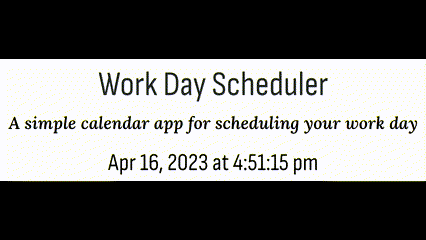
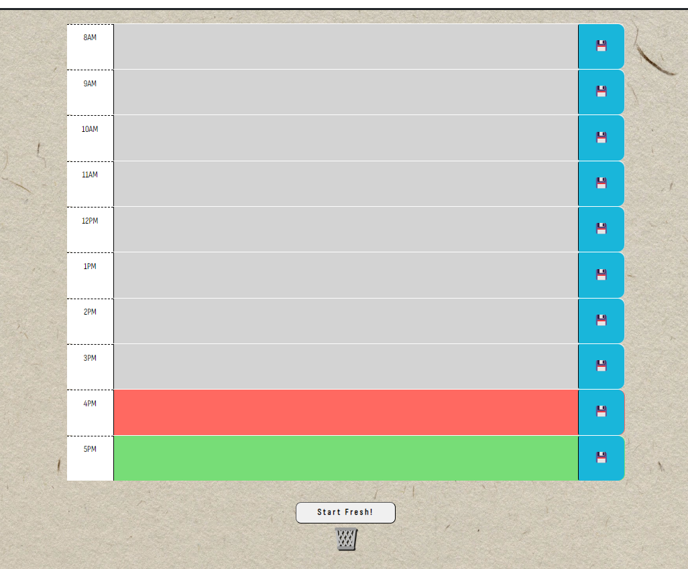
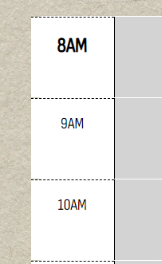
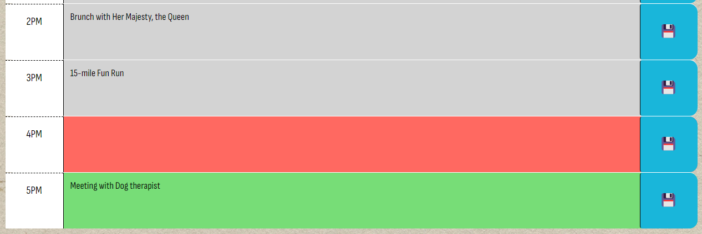
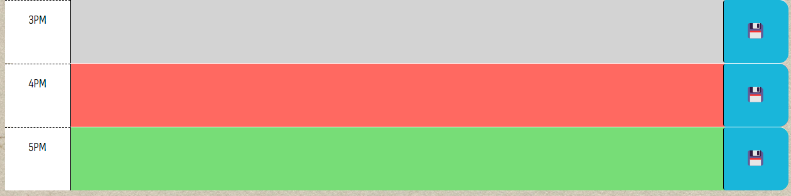
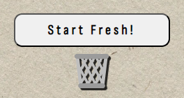
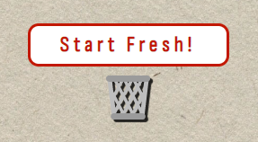

# A simple daily scheduler to plan your workday!

## Description 
This application is a simple planner designed to schedule hourly time blocks between 8am - 6pm. Starter code was provided for HTML, CSS, and JavaScript, but I have included minor personal touches to give it some life. Within this application, a user can visualize their day with past, present, and future color-code and can input his/her to-do list, save to local storage, overwrite inputs, and clear their day.

## Access 
Link to the live site: https://sunnyohk.github.io/work-day-scheduler/

- Upon launching the planner application, you will notice a live date & time ticker based on user location:

- Next, you will see the full daily schedule resting on a resume paper background with hourly time blocks beginning at 8am and ending at 6pm (the 5pm hour):

- Key features:
    - Sharper and more visible text upon hovering over each time block:
         

    - Floppy disk save icons to set your schedule inputs (with hover):
         

    - Saved events will remain within the hourly field until the user clears the list:
         

    - Color-coding to display time periods of past, present, and future based on user's current time of the day.
         
    
    - And a "Clear My Schedule" button to wipe the slate clean (complete with hover effects):
         
        

## Resources
- Bootstrap CSS framework
- Font Awesome icons
- Google Fonts 
- Day.js time integrations

## Credits 

- Tutoring sessions with EdX tutor Faran Navazi were a huge help!
- YouTube!!! I've watched so many videos and pieced the ideas together.

## License
MIT license
